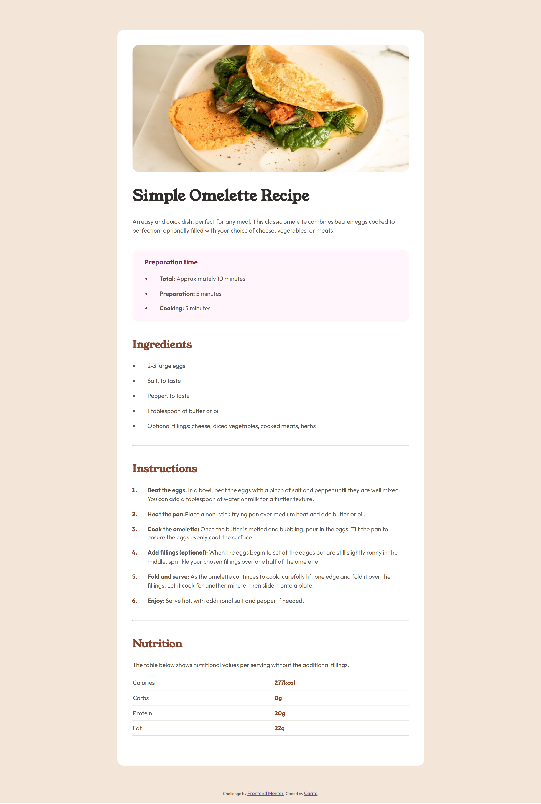

# Frontend Mentor - Recipe page solution

This is my solution to the [Recipe page challenge on Frontend Mentor](https://www.frontendmentor.io/challenges/recipe-page-KiTsR8QQKm). It’s a simple but fun challenge that helped me practice semantic HTML and responsive CSS layout.

## Table of contents

- [Overview](#overview)
  - [Screenshots](#screenshots)
  - [Links](#links)
- [My process](#my-process)
  - [Built with](#built-with)
  - [What I learned](#what-i-learned)
  - [Continued development](#continued-development)
- [Author](#author)

## Overview

### Screenshots




### Links

- Solution URL: [My solution repo link](https://github.com/carodg09/recipe-page)
- Live Site URL: [My live site link](https://carodg09.github.io/recipe-page)

## My process

### Built with

- Semantic HTML5
- CSS custom properties
- Flexbox
- Responsive layout using media queries
- Google Fonts: Young Serif & Outfit

### What I learned

I practiced building a layout using semantic HTML, and learned how to:

- Use rem/em units and custom properties for better scalability
- Apply media queries to adjust layout and image rendering on smaller screens
- Handle font embedding from Google Fonts with multiple font weights

```css
@media (max-width:768px) {
  .ui-container {
    width: 100%;
    padding: 2.5rem;
  }
}
```# recipe-page

